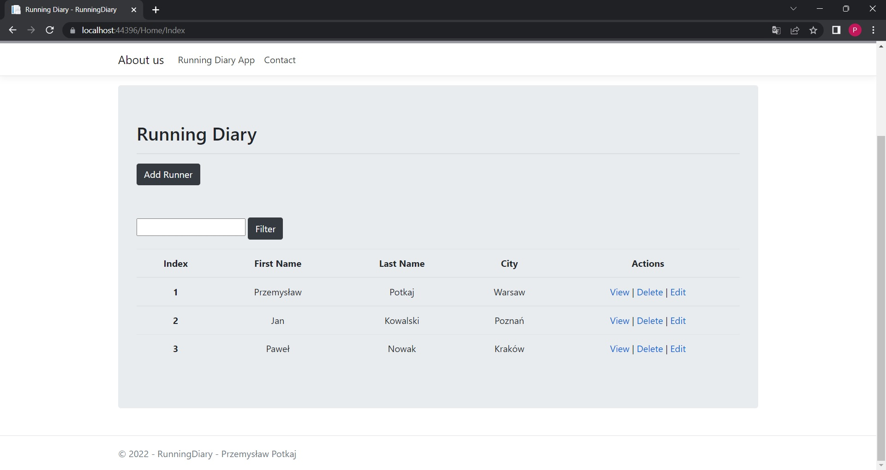
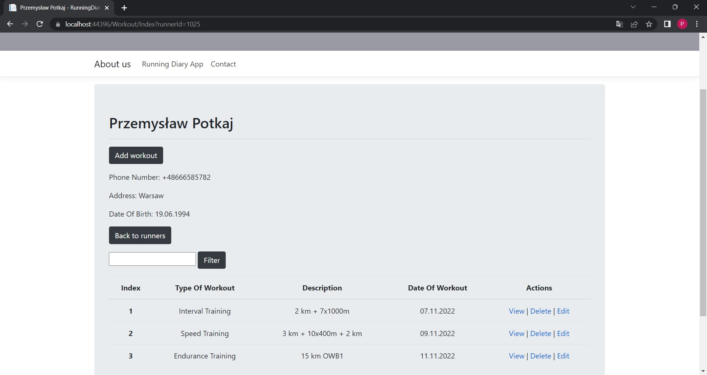
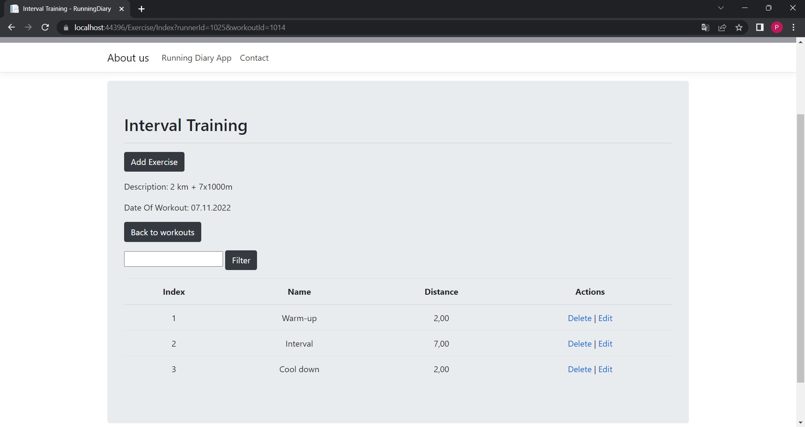
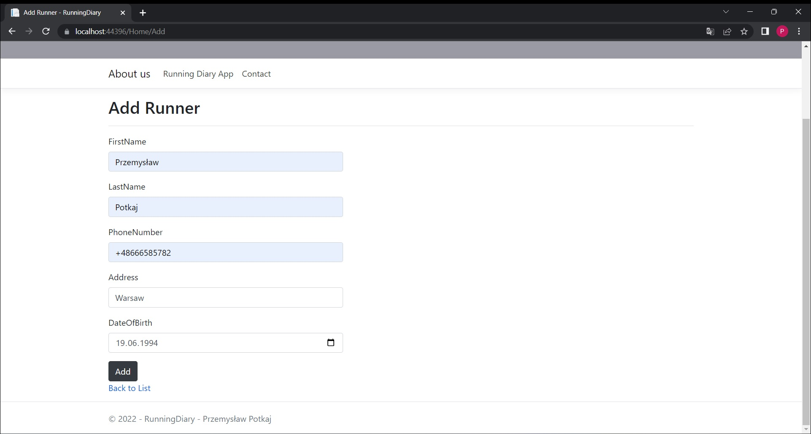
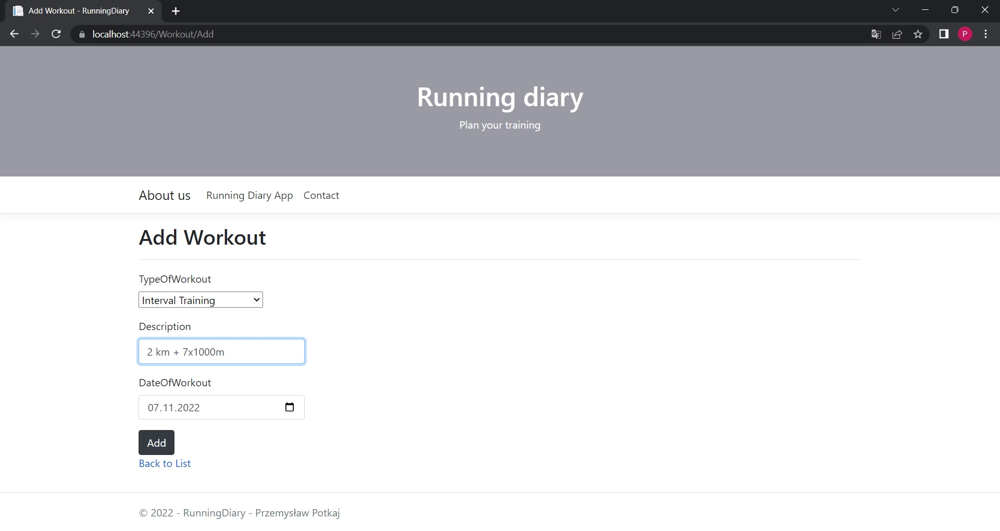
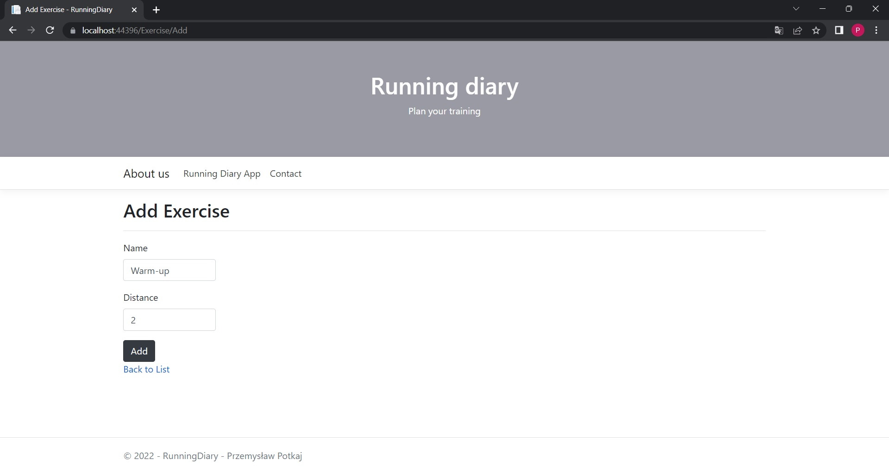

# RunningDiary

The Running Diary app is used to keep a log of your running training sessions. It is intended for the trainer and people who train. It allows you to store data about the trained runners and allows you to add and plan your training. Each added training can be additionally extended with specific exercises, depending on the type of training.

How To Use
==========

The Running Diary app is build with *ASP.NET MVC 5* and *MS SQL Server 2019*. Solutions contains three project: RunningDiary, RunningDiary.Core and RunningDiary.Database
The application is based on a local database. 
```
services.AddDbContext<RunningDiaryDbContext>(options =>
                options.UseSqlServer(@"Server=localhost;Database=RunningDiaryDatabase;Trusted_Connection=True;MultipleActiveResultSets=true"));
```

Steps to run project:

- Download all files from the repository
- Find solution RunningDiary.sln nad open in Visual Studio 2019 or later installed
- Build project to restore packages and build project
- Run solution by IIS Expres

## Project preview
TrainerView

RunnerView

WorkoutView

addRunner

addWorkout

addExercise

